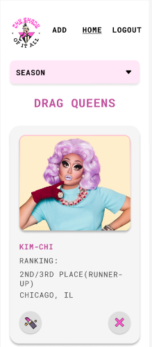

# The Shade of it All

[](https://sonarcloud.io/summary/new_code?id=isdi-coders-2023_Nary-Lozano-Final-Project-front-202304-bcn)

The Shade of it All is an App made with Vite and Typescript that allows Drag Race fans to create a List of Drag queens filtered by the season they participated in Drag Race.

Fans can add or delete a Drag queen from the list, update the information details of an existing one and use the filter by seasons (16 seasons by 2023).

## Getting Started with The Shade of it All

To run the Shade, please follow these steps:

Start a development server:

```
npm run dev
```

Build the app

```
npm run build
```

## Screenshot



## Authors

NaryLozano
